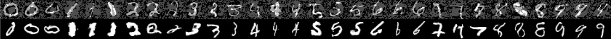
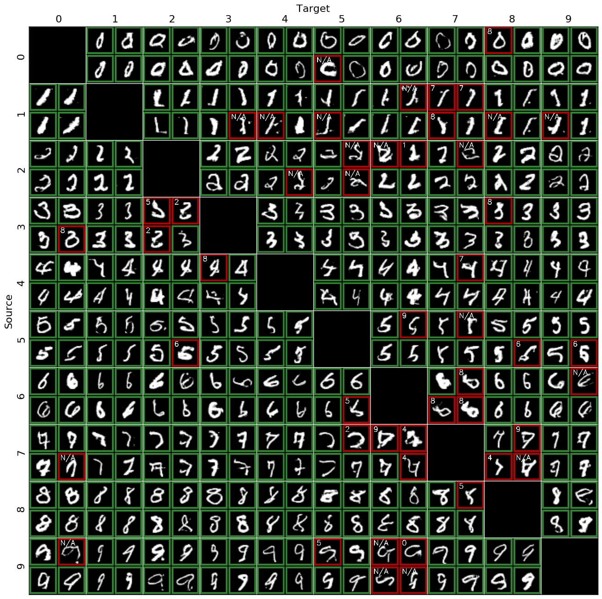
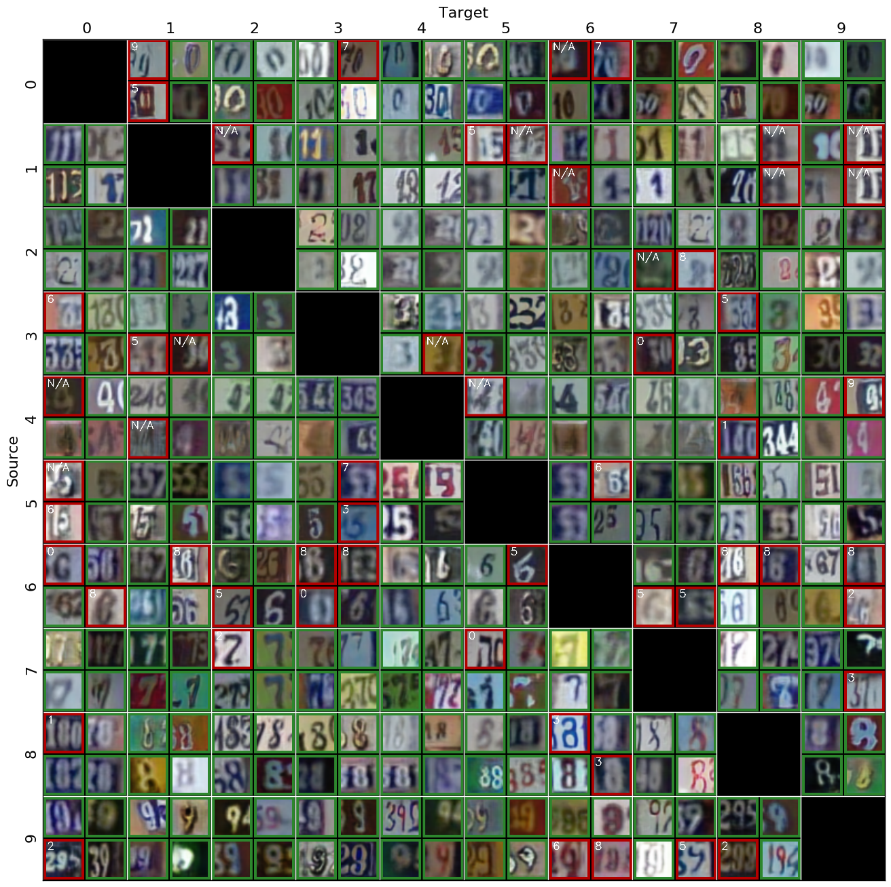
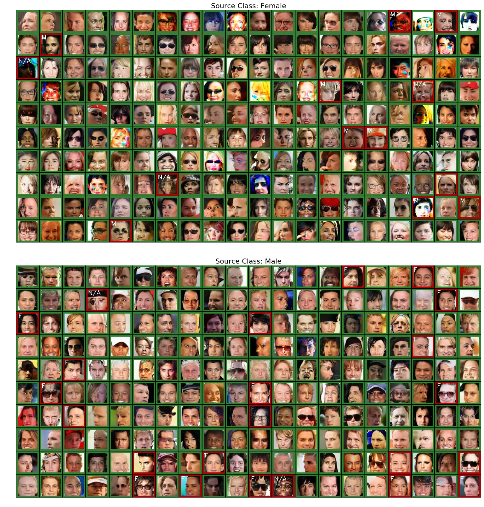

# Constructing Unrestricted Adversarial Examples with Generative Models

This repo contains necessary code for reproducing main results in the paper [Constructing Unrestricted Adversarial Examples with Generative Models](https://arxiv.org/abs/1805.07894), NIPS 2018, Montréal, Canada. 

by [Yang Song](https://yang-song.github.io/), [Rui Shu](https://ruishu.io//), [Nate Kushman](http://www.kushman.org/) and [Stefano Ermon](https://cs.stanford.edu/~ermon/), Stanford AI Lab.

---

We propose **Unrestricted Adversarial Examples**, a new kind of adversarial examples to machine learning systems. Different from traditional adversarial examples that are crafted by adding norm-bounded perturbations to clean images, unrestricted adversarial examples are _realistic images that are synthesized entirely from scratch_, and not restricted to small norm-balls. This new attack demonstrates the danger of a stronger **threat model**, where traditional defense methods for perturbation-based adversarial examples fail.

## Datasets

Here are links to the datasets used in our experiments:
* [CelebA (gender)](https://drive.google.com/open?id=1coLQbEZW6zshHVYi00IYSRiexq4RkA2x)
* [SVHN](https://drive.google.com/open?id=1uPxNdW4K-GLFhqhOgtfI1jFFNEqp2eZn)

## Running Experiments

### Training AC-GANs

In order to do unrestricted adversarial attack, we first need a good conditional generative model so that we can search on the manifold of realistic images to find the adversarial ones. You can use `train_acgan.py` to do this. For example, the following command

```bash
CUDA_VISIBLE_DEVICES=0 python train_acgan.py --dataset mnist --checkpoint_dir checkpoints/
```

will train an AC-GAN on the `MNIST` dataset with GPU #0 and output the weight files to the `checkpoints/` directory. 

Run `python train_acgan.py --help` to see more available argument options.

### Unrestricted Adversarial Attack

After the AC-GAN is trained, you can use `main.py` to do targeted / untargeted attack. You can also use `main.py` to evaluate the accuracy and PGD-robustness of a trained neural network classifier. For example, the following command

```bash
CUDA_VISIBLE_DEVICES=0 python main.py --mode targeted_attack --dataset mnist --classifier zico --source 0 --target 1
```

attacks the provable defense method from [Kolter & Wong, 2018](https://arxiv.org/pdf/1711.00851.pdf) on the `MNIST` dataset, with the source class being 0 and target class being 1. 

Run `python main.py --help` to view more argument options. For hyperparameters such as `--noise`, `--lambda1`, `--lambda2`, `--eps`,  `--z_eps`, `--lr`, and `--n_iters` (in that order), please refer to **Table. 4** in the Appendix of our [paper](https://arxiv.org/pdf/1805.07894.pdf). 

### Evaluating Unrestricted Adversarial Examples

In the paper, we use [Amazon Mechanical Turk](https://www.mturk.com/) to evaluate whether our unrestricted adversarial examples are legitimate or not. We have provided `html` files for the labelling interface in folder `amt_websites`.


## Samples

 Perturbation-based adversarial examples (top row) VS unrestricted adversarial examples (bottom-row):



Targeted unrestricted adversarial examples against robust classifiers on `MNIST` (Green borders denote legitimate unrestricted adversarial examples while red borders denote illegimate ones. The tiny white text at the top-left corder of a red image denotes the label given by the annotators. )



We also have samples for `SVHN` dataset:



Finally here are the results for `CelebA`



## Citation

If you find the idea or code useful for your research, please consider citing our [paper](https://arxiv.org/abs/1805.07894):

```bib
@inproceedings{song2018generative,
  author={Song, Yang and Shu, Rui and Kushman, Nate and Ermon, Stefano},
  booktitle = {Advances in Neural Information Processing Systems (NIPS)},
  title = {Constructing Unrestricted Adversarial Examples with Generative Models},
  year = {2018},
}
```

